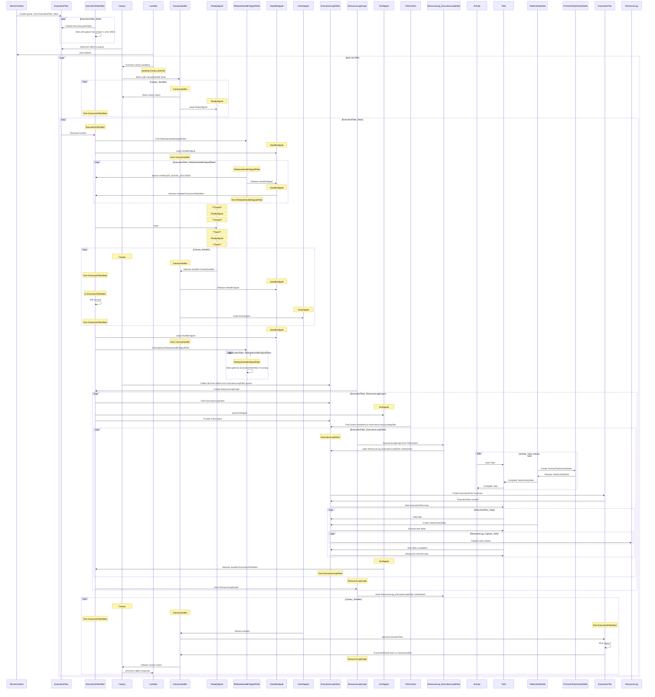

```mermaid
sequenceDiagram
ServerContext->>ExecutionFiber: Create queue, start ExecutionFiber_Main
loop ExecutionFiber_Main
    ExecutionFiberMain->>ExecutionFiber: Forked from ExecutionFiber
    ExecutionFiberMain->>ExecutionFiberMain: Wait until queue has at least 1 actor effect
end
Canary->>ExecutionFiber: Add Actor effect to queue
Lambda->>ServerContext: (mjs loaded)
loop MJS SCOPE
    Lambda->>Canary: Execute Canary handler()
    Note over Lambda: awaiting Canary promise
    Canary->>CanaryHandler: block until CanaryHandler done
    loop Canary_Handler
        Note over CanaryHandler: CanaryHandler
        CanaryHandler->>Canary: Hold Canary mutex
        Note over ReadySignal: ReadySignal
        CanaryHandler->>ReadySignal: await ReadySignal
        Note over ExecutionFiberMain: from ExecutionFiberMain
    end
    loop ExecutionFiber_Main
        Note over ExecutionFiberMain: ExecutionFiberMain
        ExecutionFiber->>ExecutionFiberMain: Received Canary
        ExecutionFiberMain->>ReleaseHandlerSignalFiber: Fork ReleaseHandlerSignalFiber
        Note over HandlerSignal: HandlerSignal
        ExecutionFiberMain->>HandlerSignal: await HandlerSignal
        Note over CanaryHandler: from CanaryHandler
        loop ExecutionFiber_ReleaseHandlerSignalFiber
            Note over ReleaseHandlerSignalFiber: ReleaseHandlerSignalFiber
            ReleaseHandlerSignalFiber->>ExecutionFiberMain: Wait for HANDLER_SIGNAL_SECONDS
            ReleaseHandlerSignalFiber->>HandlerSignal: Release HandlerSignal
            Note over HandlerSignal: HandlerSignal
            HandlerSignal->>ExecutionFiberMain: releases awaited ExecutionFiberMain
            Note over ReleaseHandlerSignalFiber: from ReleaseHandlerSignalFiber
        end
        Note over ReadySignal: **Closed**
        Note over ReadySignal: ReadySignal
        Note over ReadySignal: **Closed**
        ExecutionFiberMain->>ReadySignal: Open
        Note over ReadySignal: **Open**
        Note over ReadySignal: ReadySignal
        Note over ReadySignal: **Open**
        loop Canary_Handler
            Note over Canary: Canary
            Note over CanaryHandler: CanaryHandler        
            ReadySignal->>CanaryHandler: releases awaited CanaryHandler
            Note over ExecutionFiberMain: from ExecutionFiberMain   
            Note over HandlerSignal: HandlerSignal
            CanaryHandler->>HandlerSignal: Release HandlerSignal
            Note over ExecutionFiberMain: to ExecutionFiberMain
            ExecutionFiberMain->>ExecutionFiberMain: Still running
            Note over DoneSignal: DoneSignal
            CanaryHandler->>DoneSignal: await DoneSignal
            Note over ExecutionFiberMain: from ExecutionFiberMain
        end
        Note over HandlerSignal: HandlerSignal
        ExecutionFiberMain->>HandlerSignal: await HandlerSignal
        Note over CanaryHandler: from CanaryHandler
        ExecutionFiberMain->>ReleaseHandlerSignalFiber: Interrupting ReleaseHandlerSignalFiber
        loop ExecutionFiber_ReleaseHandlerSignalFiber
            Note over ReleaseHandlerSignalFiber: ReleaseHandlerSignalFiber
            ReleaseHandlerSignalFiber->>ReleaseHandlerSignalFiber: Interrupted by ExecutionFiberMain if running
        end        
        Canary->>ExecutionLoopFiber: Collect all Actor effects into ExecutionLoopFiber queue
        ResourceLogScope->>ExecutionFiberMain: Create ResourceLogScope
        loop ExecutionFiber_ResourceLogScope:
            ExecutionFiberMain->>ExecutionLoopFiber: Fork ExecutionLoopFiber
            Note over ExitSignal: ExitSignal
            ExecutionFiberMain->>ExitSignal: await ExitSignal

            ExecutionFiberMain->>ExecutionLoopFiber: Provide FileContext
            FileContext->>ExecutionLoopFiber: FileContext initialized to /!execution/-resourcelog/fiber
            loop ExecutionFiber_ExecutionLoopFiber
                Note over ExecutionLoopFiber: ExecutionLoopFiber
                ResourceLogScope->>ResourceLog_ExecutionLoopFiber: ResourceLogScope from FileContext
                ResourceLog_ExecutionLoopFiber->>ExecutionLoopFiber: open ResourceLog_ExecutionLoopFiber writestream

                loop Activity_Task_Interaction
                    Activity->>Task: Start Task
                    TaskActivityDelta->>PromiseTaskActivityDelta: Create PromiseTaskActivityDelta
                    PromiseTaskActivityDelta->>TaskActivityDelta: Resolve TaskActivityDelta
                    TaskActivityDelta->>Task: Complete TaskActivityDelta
                    Task->>Activity: Complete Task
                end

                ExecutionLoopFiber->>ExecutionPlan: Create ExecutionPlan instances
                ExecutionPlan->>ExecutionLoopFiber: ExecutionPlan created
                ExecutionLoopFiber->>Task: Start ExecutionPlan loop
                loop ExecutionPlan_Task
                    Task->>ExecutionLoopFiber: Yield task
                    TaskActivityDelta->>ExecutionLoopFiber: Create TaskActivityDelta
                    ExecutionLoopFiber->>Task: Execute task delta
                    loop ResourceLog_Capture_Task
                        ExecutionLoopFiber->>ResourceLog: Capture task context
                    end
                    Task->>ExecutionLoopFiber: Task delta completed
                    ExecutionLoopFiber->>Task: Sleep and continue loop
                end

                Note over ExitSignal: ExitSignal
                ExitSignal->>ExecutionFiberMain: releases awaited ExecutionFiberMain
                Note over ExecutionLoopFiber: from ExecutionLoopFiber
            end
            Note over ResourceLogScope: ResourceLogScope
            ExecutionFiberMain->>ResourceLogScope: close ResourceLogScope
        end
        ResourceLogScope->>ResourceLog_ExecutionLoopFiber: close ResourceLog_ExecutionLoopFiber writestream

        loop Canary_Handler
            Note over Canary: Canary
            Note over CanaryHandler: CanaryHandler        
            Note over ExecutionFiberMain: from ExecutionFiberMain
            Note over ExecutionPlan: from ExecutionFiberMain
            DoneSignal->>CanaryHandler: release awaited
            CanaryHandler->>ExecutionPlan: report() ExecutionPlan
            ExecutionPlan->>ExecutionPlan: think about it
            ExecutionPlan->>CanaryHandler: ExecutionResult back to CanaryHandler
            Note over ResourceLogScope: ResourceLogScope
            CanaryHandler->>Canary: release Canary mutex
            Canary->>Lambda: send json object response
        end
    end
end
```